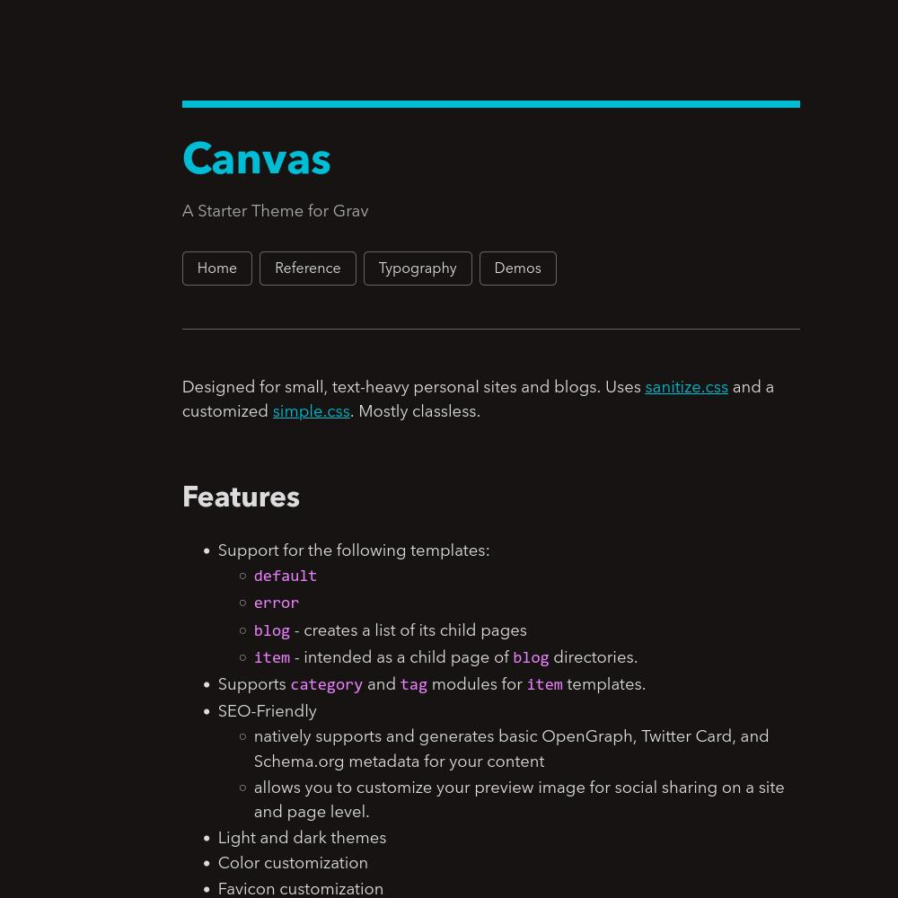

# Canvas Theme

A starter theme for Grav CMS. Designed for small, text-heavy personal sites and blogs. Uses [sanitize.css](https://csstools.github.io/sanitize.css/) and a customized [simple.css](https://simplecss.org/). Mostly classless.



## Features

- Support for the following templates:
	+ `default`
		* aliases: `page`
	+ `error`
	+ `blog` - creates a list of its child pages
		* aliases: `folder`, `archive`, `index`
	+ `item` - intended as a child page of `blog` directories.
		* aliases: `post`, `article`
	+ `form`
- Supports `category` and `tag` taxonomies for `item` templates.
- SEO-Friendly
	+ natively supports and generates basic OpenGraph, Twitter Card, and Schema.org metadata for your content
	+ allows you to customize your preview image for social sharing on a site and page level.
- Light and dark themes
- Color customization
- Favicon customization
- Switch navigation between the header and footer.

## Plugin Requirements

- Grav >= 1.7
- Sitemap
- Feed
- Form
- Admin

Note: Support for `feed` and `form` is still basic and will be improved in the future. `blog` templates must explicitly define `content.item` attributes in their frontmatter for the feed to show. See [feed plugin repo](https://github.com/getgrav/grav-plugin-feed) for more details.

## Installation

The current iteration of Canvas can only be installed via cloning the repository to your `user/themes`. Activate it by editing or adding the following line in your `user/config/system.yaml`.

```yaml
pages:
    theme: canvas
```

Clear your cache via the Admin panel or through `bin/grav cache` in your project terminal. Load your page to see your Canvas site come to life.

Copy the default `canvas.yaml` bundled with the theme to your `user/config/themes` to start customizing the colors of your site using hex codes.

However, editing the theme settings via the Grav Admin panel is recommended to use features not included in the default theme config file, such as favicon and preview image customization.

## Upcoming Features

The following features are planned before the release of Version 1.0:

- support for the following plugins
	- Pagination (`pagination`)
    * Breadcrumb (`breadcrumb`)
    * TaxonomyList (`taxonomylist`)
    * Related Pages (`relatedpages`) 
- incorporate useful `hypertext` theme settings
- demo and testing content
- accessibility improvements.